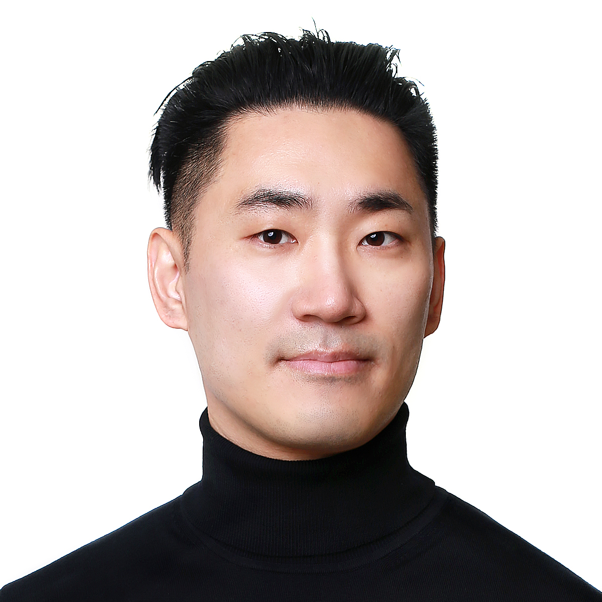

Hi, I'm the CEO of [Cowork AI](https://cwrk.ai/). For more information, please visit [https://cwrk.ai](https://cwrk.ai).

I was an Entrepreneur in Residence at [Hashed](https://www.hashed.com) from October 2021 to April 2022. I worked on web3 and crypto projects. Prior to joining Hashed, I was a software engineer at [Waymo](https://waymo.com), formerly known as the Google self-driving car project, working on vision-based detection and classification for self-driving cars using various machine learning techniques.[^1] 

[CV](./assets/wjkoh-cv-public.pdf) \| [Google Scholar](https://scholar.google.com/citations?user=Mz6M9j0AAAAJ&hl=en) \| [LinkedIn](https://www.linkedin.com/in/wjkoh)

## Recent news
- Apr 2025. Launched [CareerFit](https://career.cwrk.ai), a Gen AI-based resume generator and job posting matching service.
- Apr 2024. Launched [Bake](https://api.getbake.ai/), cutting-edge AI APIs for generating stunning portraits using selfies or ultrasound images. Facemagic transforms selfies into high-quality character portraits or virtual model faces, while Babymagic creates realistic baby photos from 3D fetal ultrasounds.
- Nov 2022. Launched [SumUp](https://sumup.page/), a web app that makes articles easier to understand using AI. Based on GPT-3, the app provides short summary, AI-generated Q&As, discussion between AIs, AI-generated user comments, and so on. [Version 2](https://v2-2lo72j2xaq-uc.a.run.app/) is on the way.
- Nov 2021. Launched [Pass the Baton](https://baton.art/), an NFT art project with purpose, on November 18th, 2021. The project creates a sustainable platform for giving on the blockchain. The NFTs are [ERC-721](https://ethereum.org/en/developers/docs/standards/tokens/erc-721/) tokens on [Ethereum](https://ethereum.org/en/). See more at https://baton.art.

## Press
* Bloter - [임신·육아 시장도 AI로...휴먼스케이프와 협업하는 구글 출신 고우종 대표](https://n.news.naver.com/mnews/article/293/0000060502?sid=105)
* XREAL - [구글 웨이모 엔지니어가 #Hashed에 간 이유 - Hashed EIR 고우종을 만나다.](https://www.xreal.info/24642ad7-40b3-41a8-8aff-b8f639568d20)
* 한국경제 - [박사 학위·구글 모두 버리고…30대 청년의 '과감한 선택' [황정수의 인(人) 실리콘밸리]](https://www.hankyung.com/it/article/202110021249i)
* 한국경제 - [고우종 前 엔지니어 "세상 바꿀 아이템 찾으러 구글 박차고 나왔죠"](https://www.hankyung.com/economy/article/2021100568691) ([PDF](assets/the_korea_economic_daily_20211006_A032.pdf))
* 김단테 - [테슬라와 차원이 다른 자율주행 능력? 웨이모 초기멤버가 알려드림](https://youtu.be/20wE2yRRTuw)

## Work experience


 * [{{ page.title }}]({{ page.url }})


* CEO, [Cowork AI, Inc.](https://cwrk.ai), Nov 2022 - present.
* Entrepreneur in Residence, [Hashed](https://www.hashed.com), Oct 2021 - Mar 2022.
* Software Engineer, [Waymo LLC](http://waymo.com), May 2016 - Jun 2021.

## Education
* Ph.D. student, Computer Science,  Aug. 2012 - May 2016 (on leave)  
University of California, Berkeley
* M.S., Computer Science, May 2016 ([thesis](https://www2.eecs.berkeley.edu/Pubs/TechRpts/2016/EECS-2016-5.html))  
University of California, Berkeley
* B.S., Computer Science and Engineering, Feb. 2012  
[Seoul National University](http://en.snu.ac.kr), Seoul, South Korea

## Publications


## Course projects


 * [{{ page.title }} ({{ page.date | date: "%b %Y" }})]({{ page.url }})


## Showcase





