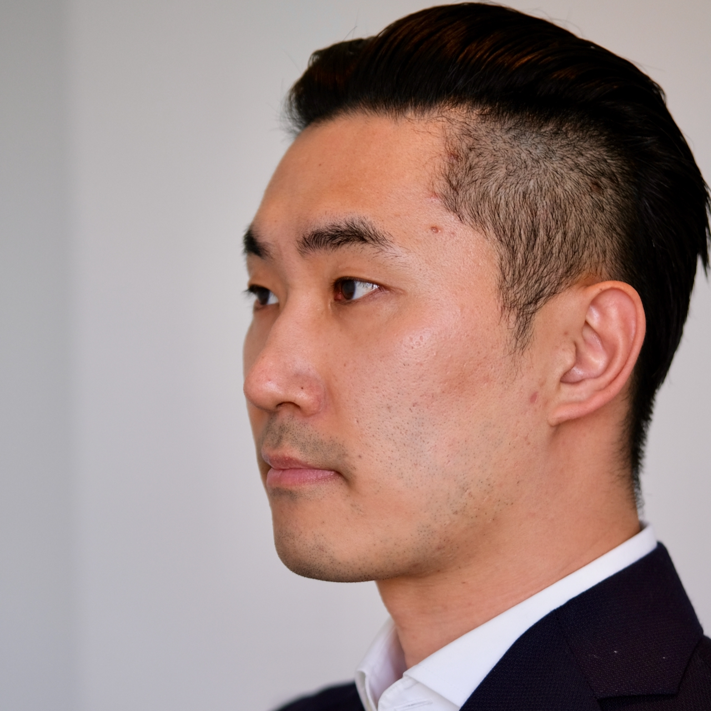

## About me

Hi, I'm Woojong.

I was a software engineer at [Waymo](https://waymo.com), formerly known as the [Google self-driving car project](https://www.google.com/selfdrivingcar), working on vision-based detection and classification for self-driving cars using various machine learning techniques. 

[CV](./assets/wjkoh-cv-public.pdf) \| [Google Scholar](https://scholar.google.com/citations?user=Mz6M9j0AAAAJ&hl=en) \| [LinkedIn](https://www.linkedin.com/in/wjkoh)

## Press
* 한국경제 - [박사 학위·구글 모두 버리고…30대 청년의 '과감한 선택' [황정수의 인(人) 실리콘밸리]](https://www.hankyung.com/it/article/202110021249i)
* 한국경제 - [고우종 前 엔지니어 "세상 바꿀 아이템 찾으러 구글 박차고 나왔죠"](https://www.hankyung.com/economy/article/2021100568691)

## Work experience


 * [{{ page.title }}]({{ page.url }})


* Software Engineer, [Waymo LLC](http://waymo.com), May 2016 - Jun 2021  

## Education
* Ph.D. student, Computer Science,  Aug. 2012 - May 2016 (on leave)  
University of California, Berkeley
* M.S., Computer Science, May 2016  
University of California, Berkeley
* B.S., Computer Science and Engineering, Feb. 2012  
[Seoul National University](http://en.snu.ac.kr), Seoul, South Korea

## Publications


## Course projects


 * [{{ page.title }} ({{ page.date | date: "%b %Y" }})]({{ page.url }})


## Showcase






Last updated: 2020-11-18
